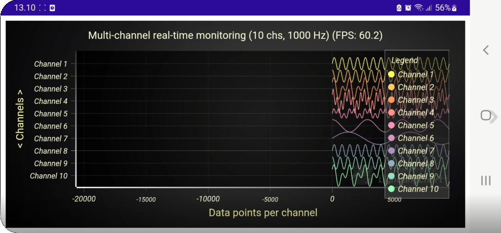
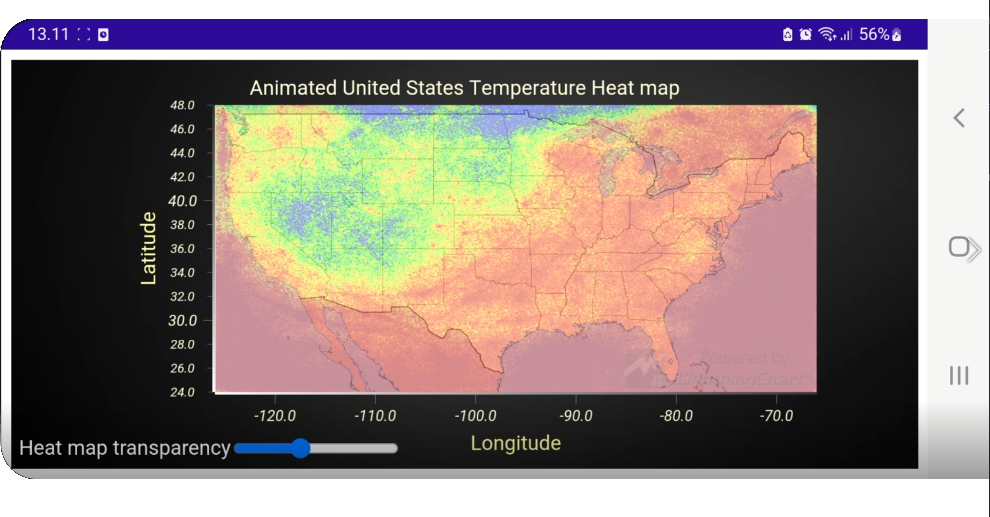
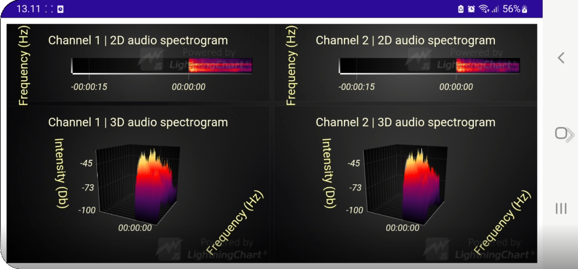
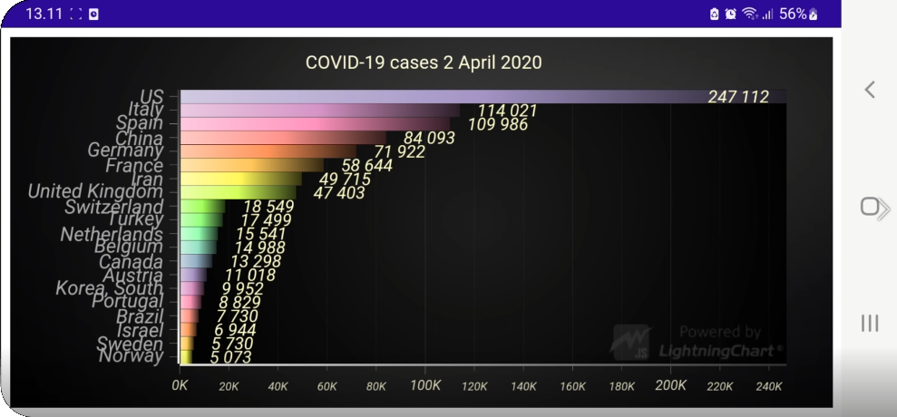
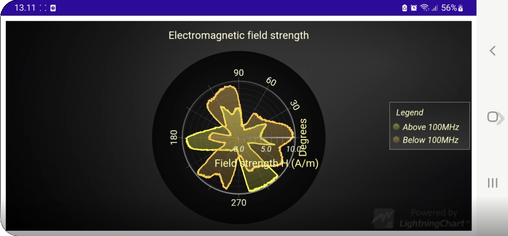
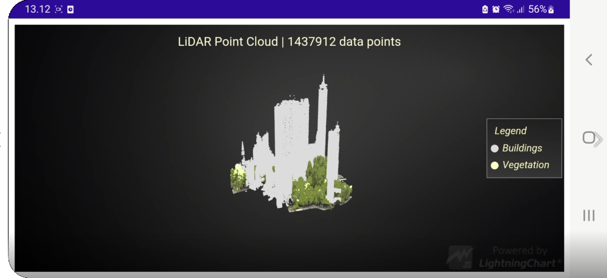

# LightningChart JS x MAUI project template

This repository is proof of compatibility between [LightningChart JS](https://www.arction.com/lightningchart-js/) and [MAUI](https://docs.microsoft.com/en-us/dotnet/maui/).

**LightningChart JS** is a performance-oriented real-time JavaScript charting library which allows data visualization without being restricted by otherwise normal limitations on data amounts and refresh rates. It can target practically all platforms, such as web, desktop and mobile apps.

Learn more about LightningChart JS [here](https://www.arction.com/lightningchart-js/).

**MAUI** (.NET Multi-platform UI) is a cross-platform UI toolkit for mobile and desktop apps. As 04/2022 it is still in "preview", which means that the framework can be substantially modified before official release.

Learn more about MAUI [here](https://docs.microsoft.com/en-us/dotnet/maui/).

## Results

In order to test that all the important features of LightningChart work and perform well in Android, we tested a hand-picked collection from our [Interactive Examples gallery](https://www.arction.com/lightningchart-js-interactive-examples/).

**Watch the recording** on an Android phone in [YouTube](https://youtu.be/qrLJ4tJpQyY).

Featured examples:

### Real-Time Line Charts

Note the capped refresh rate measurement (FPS = frames per second) even with 10 000 incoming data points every second. 

### Real-Time Heatmap Charts

### Real-Time Spectrogram Charts

### Real-Time Racing Bar Charts

### Real-Time Polar Chart

### LiDAR Point Cloud Chart

By running these examples, we learned that the GPU capabilities of modern Android phones are quite strong indeed! All of the examples (even the very heavy ones, such as LiDAR Point Cloud visualization) ran smoothly without any visible spikes in user experience.

## For Developers

Click [here](./README-dev.md) for a separate _developer README_.
